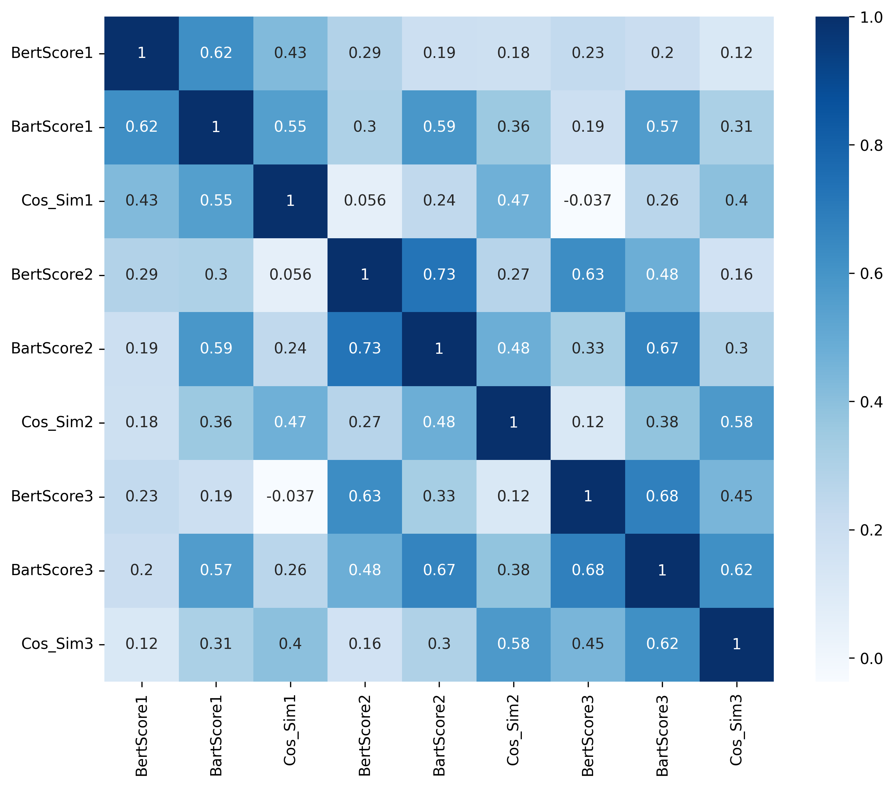
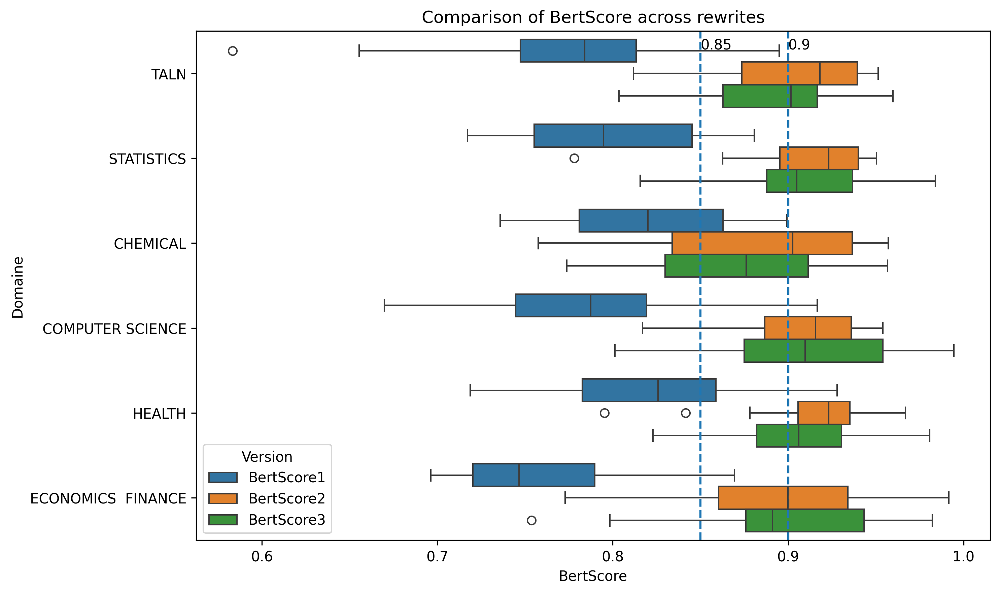
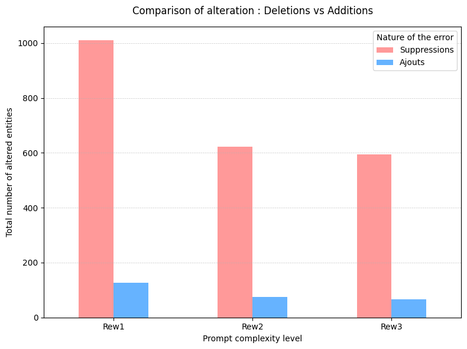
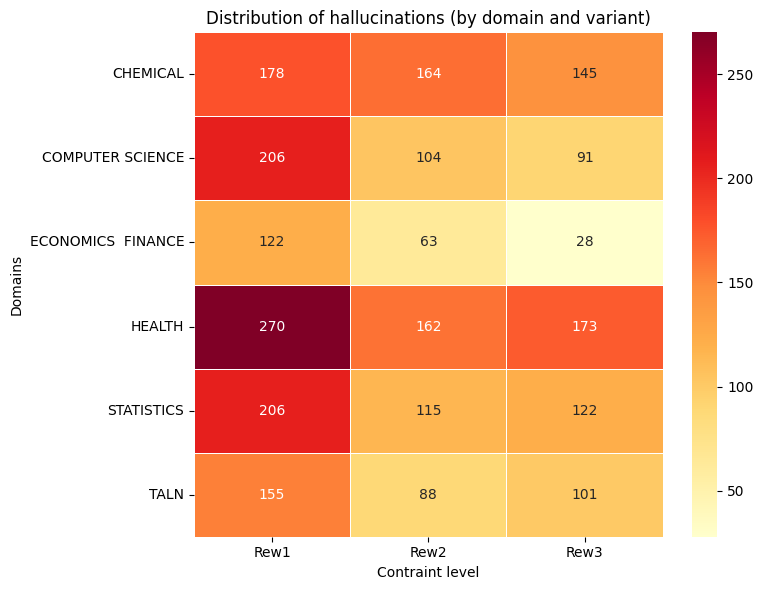

# PROJET TER 2026 : Évaluer la fidélité factuelle des réécritures scientifiques générées par IA

---

## Description du projet

Les grands modèles de langue (Large Language Models, LLM) sont de plus en plus utilisés pour améliorer la clarté et la lisibilité des textes scientifiques par reformulation. Cependant, ces modèles peuvent introduire des **altérations factuelles** lors de la réécriture, telles que la modification de nombres, d’unités, de références ou de noms propres, etc.

Ce projet vise à **évaluer automatiquement et manuellement (si possible) la fidélité factuelle** des réécritures scientifiques générées par un LLM, en fonction du **niveau de précision des consignes de réécriture (prompt)** fournies au modèle.

---

## Objectifs

Les objectifs principaux du projet sont :

- mesurer la **fréquence des erreurs factuelles** introduites lors de la réécriture de textes scientifiques ;
- comparer l’impact de **différentes instructions de réécriture** sur la fidélité factuelle ;
- proposer une **méthode simple de détection automatique** des altérations factuelles ;
- analyser le compromis entre **fidélité factuelle** et **qualité rédactionnelle**.

---

## Jeu de données

- **120 articles scientifiques open-access**, répartis en **6 domaines (20 articles / domaine)** :
  - Traitement Automatique des Langues (TALN)
  - Statistiques
  - Santé
  - Informatique
  - Chimie
  - Économie et Finances
- Pour chaque article, un **paragraphe** est extrait, contenant :
  - au moins un **nombre**
  - une **unité**
  - un **nom propre ou une référence**

---

## Méthodologie et Pipeline

Le projet est structuré autour d'un pipeline d'évaluation hybride :
1. **Génération (Prompting) :** Réécriture de paragraphes scientifiques avec `Llama-3.2-1B-Instruct` selon 3 niveaux de contraintes :
   * **Prompt 1 (Sans contrainte) :** *"Améliore ce paragraphe"*
   * **Prompt 2 (Contrainte partielle) :** *"Améliore ce paragraphe sans modifier les nombres ni les unités"*
   * **Prompt 3 (Contrainte stricte) :** *"Améliore ce paragraphe sans modifier aucun fait, chiffre, unité, référence ni nom propre"*
2. **Extraction d'Entités Nommées (NER) :** Utilisation d'un modèle NLP généraliste (`en_core_web_sm` via spaCy) couplé à des expressions régulières (RegEx) pour capturer les nombres, unités et entités critiques (formules, équations, molécules chimiques, etc.).
3. **Évaluation Multidimensionnelle :** 
   - *Sémantique :* BERTScore, BARTScore.
   - *Factuelle :* FactCC, DAE, etc..
   - *Juge IA :* Utilisation de `Llama-3.1-8B-Instruct` comme évaluateur (LLM-as-a-judge).

---

## Installation et Prérequis

> **⚠️ DISCLAIMER**
> 
> Compte tenu du temps de calcul considérable et des ressources nécessaires pour exécuter la majorité des fichiers `.ipynb` (génération des réécritures par le LLM, évaluations et analyses), il est préférable de déployer et de faire tourner ce projet sur un serveur dédié (idéalement équipé de GPU), plutôt que sur une machine locale standard.

Assurez-vous d'avoir Python 3.8+ installé. Clonez ce dépôt, puis installez les dépendances requises :

```bash
# Cloner le dépôt
git clone https://github.com/Baron921/scientific-ai-fidelity.git
cd scientific-ai-fidelity

# Installer les librairies Python
pip install -r requirements.txt
```

---

## Visualisation Interactive (Dashboard Streamlit)

Une application Streamlit a été développée pour explorer les résultats de manière interactive. Ce tableau de bord permet de visualiser les statistiques du corpus, de comparer l'impact des trois niveaux de prompts (1, 2, 3) et d'analyser la répartition des hallucinations factuelles par domaine scientifique.

Pour lancer l'application en local, exécutez la commande suivante à la racine du projet :

```bash
streamlit run app/app_streamlit.py
```
--- 

## Résultats et analyses

Nos résultats indiquent que le meilleur équilibre entre fluidité et exactitude est atteint avec un niveau modéré de contrainte (prompt 2). 

Une analyse détaillée via notre pipeline NER confirme que le modèle a tendance à omettre plus d'informations plutôt qu'à en inventer. Elle montre également que le modèle est particulièrement vulnérable dans les domaines hautement techniques, tels que la chimie, et que l'accumulation d'un trop grand nombre de contraintes finit par dépasser ses capacités, ce qui nuit à ses performances globales.

**
Corrélations entre les mesures de cohérence sémantique et textuelle

**
Diagrammes BERTScore

**
Comparaison des alteractions : suppressions et ajouts

**
Répartition des hallucinations (par domaine et par type)


> **Explorez les résultats en détail !**
> Ces conclusions proviennent d'une analyse macroscopique. Pour plonger dans les données, comparer les textes sources et générés phrase par phrase, et visualiser ces graphiques de manière interactive, **nous vous invitons fortement à lancer le Dashboard Streamlit**.
